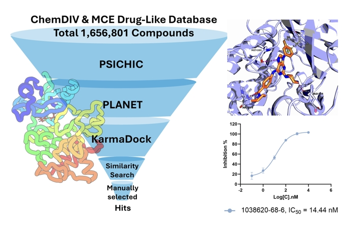

## Overview# IRAK4 Inhibitor Discovery Using Multi-Level Virtual Screening Pipeline

In this study, we developed a multi-level virtual screening pipeline to identify a novel IRAK4 inhibitor, **1038620-68-6**, with potent inhibitory activity. The compound demonstrated an IC50 value of 14.44 nM and exhibited promising therapeutic potential in large-cell lymphoma treatment.

